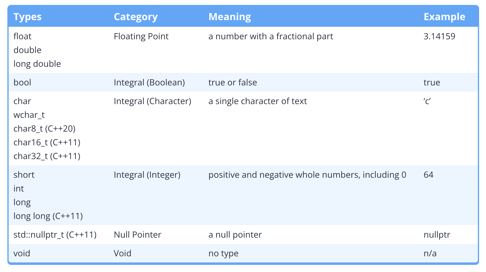
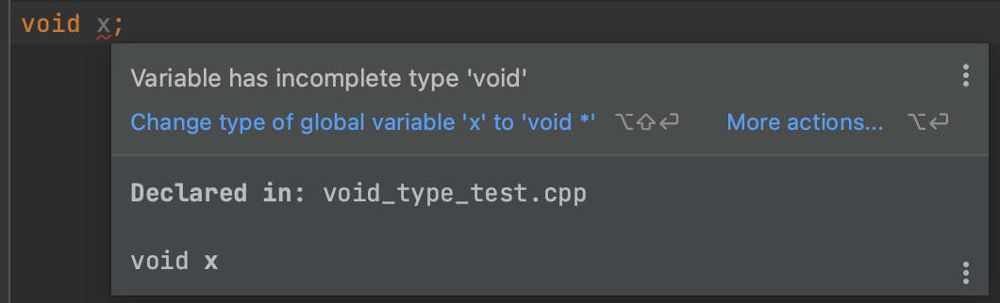
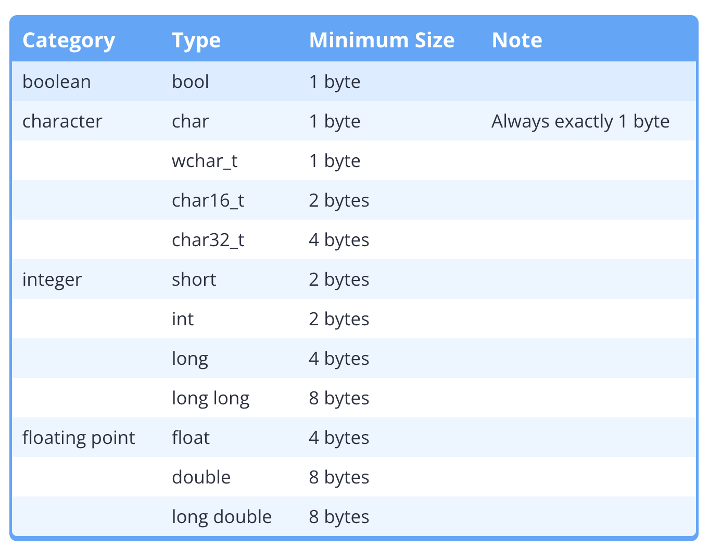
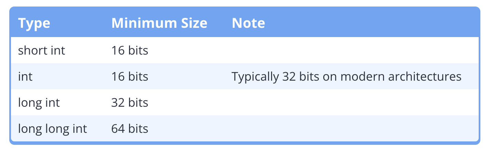
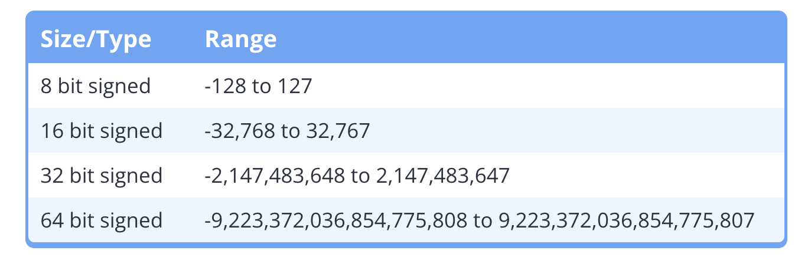
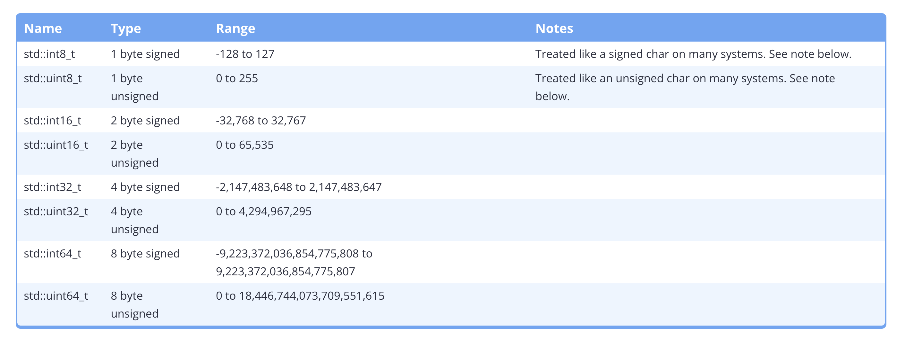
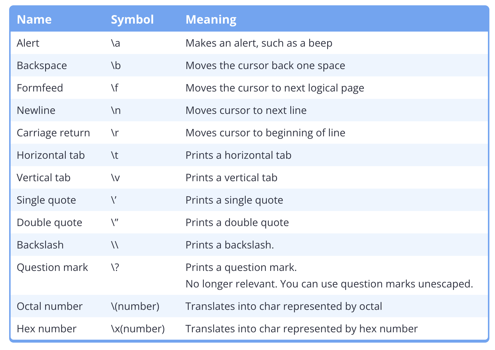
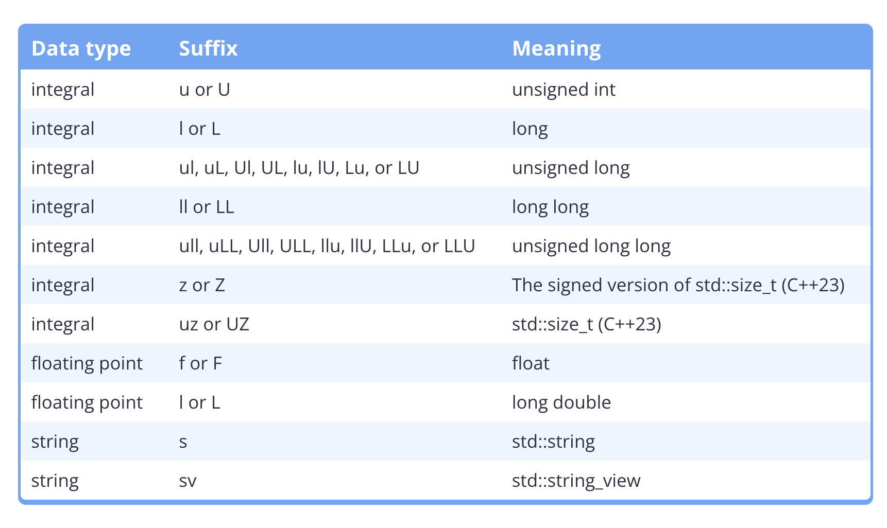

# 4 - Fundamental Data Types

## [4.1 — Introduction to fundamental data types](https://www.learncpp.com/cpp-tutorial/introduction-to-fundamental-data-types/)

### 4.1.1 - Memory 101

1. Memory is organized into sequential units called memory addresses (or addresses for short).
2. Each memory address holds 1 byte of data.
3. A byte is a group of bits that are operated on as a unit. The modern
   standard is that a byte is comprised of 8 sequential bits.
4. In C++, we typically work with “byte-sized” chunks of data.

#### 4.1.2 - Data Type

1. Because all data on a computer is just a sequence of bits, we use a data type (often called a “type” for short)
   to tell the compiler how to interpret the contents of memory in some meaningful way.
2. When you give an object a value, the compiler and CPU take care of encoding your value into the appropriate
   sequence of bits for that data type, which are then stored in memory (remember: memory can only store bits).  
   Conversely, when the object is evaluated to produce a value, that sequence of bits is reconstituted back into the
   original value.

#### 4.1.3 - Fundamental Data Types

C++ comes with built-in support for many different data types. These are called **fundamental data types**, but are
often informally called **basic types**, **primitive types**, or **built-in types**.



### 4.1.4 - Integer, Integral, and Integral Type

1. The terms integer and integral are similar, but have different meanings. An integer is a specific data type that hold
   non-fractional numbers, such as whole numbers, 0, and negative whole numbers. Integral means “like an integer”.
2. Most often, integral is used as part of the term **integral type**, which includes all of the Boolean, characters,
   and integer types (also enumerated types, which we’ll discuss in chapter 9). Integral type are named so because they
   are stored in memory as integers, even though their behaviors might vary (which we’ll see later in this chapter when
   we talk about the character types).

### 4.1.5 - String

Most modern programming languages include a fundamental string type (strings are a data type that lets us hold a
sequence of characters, typically used to represent text). In C++, strings aren’t a fundamental type (they’re a compound
type). But because basic string usage is straightforward and useful, we’ll introduce strings in this chapter as well (in
lesson 4.17 -- Introduction to std::string).

### 4.1.6 - The `_t` suffix

Many of the types defined in newer versions of C++ (e.g. std::nullptr_t) use a _t suffix. This suffix means “type”, and
it’s a common nomenclature applied to modern types.

If you see something with a _t suffix, it’s probably a type. But many types don’t have a _t suffix, so this isn’t
consistently applied.

## [4.2 — Void](https://www.learncpp.com/cpp-tutorial/void/)

Void is the easiest of the data types to explain. Basically, void means “no type”!

Consequentially, variables can not be defined with a type of void:


### 4.2.1 - Use Case 1: Functions that do not return a value

Most commonly, void is used to indicate that a function does not return a value:

### 4.2.2 - Use Case 2: (Deprecated) Functions that do not take parameters

In C, void is used as a way to indicate that a function does not take any parameters:

```c++
int getValue(void) // void here means no parameters
{
   int x{};
   std::cin >> x;
   return x;
}
```

Although this will compile in C++ (for backwards compatibility reasons), this use of keyword void is considered
deprecated in C++. The following code is equivalent, and preferred in C++:

```c++
int getValue() // empty function parameters is an implicit void
{
    int x{};
    std::cin >> x;
    return x;
}
```

### 4.2.3 - Use Case 3: Void Pointer

The void keyword has a third (more advanced) use in C++ that we cover in section 11.14 -- Void pointers.

## [4.3 — Object sizes and the sizeof operator](https://www.learncpp.com/cpp-tutorial/object-sizes-and-the-sizeof-operator/)

### 4.3.1 - Most Objects Take More Than 1 Byte && Why We Should Know That?

1. Most objects possess more than 1 byte
   As we mentioned before, one memory address refers to one byte(8 bits). But most objects actually take up more than 1
   byte of memory. A single object may use 2, 4, 8, or even more consecutive memory addresses. The amount of memory that
   an object uses is based on its data type.

2. Compiler handles object size and memory address calculation based on data type
   Because we typically access memory through variable names (and not directly via memory addresses), the compiler is
   able to hide the details of how many bytes a given object uses from us. When we access some variable x, the compiler
   knows how many bytes of data to retrieve (based on the type of variable x), and can handle that task for us.

3. Why we need to know the size of bytes an object uses?
    1. the more memory an object uses, the more information it can hold. To generalize, an object with n bits (where n
       is an integer) can hold 2n (2 to the power of n, also commonly written 2^n) unique values. Thus, the size of the
       object puts a limit on the amount of unique values it can store -- objects that utilize more bytes can store a
       larger number of unique values. We will explore this further when we talk more about integers.
    2. Second, computers have a finite amount of free memory. Every time we define an object, a small portion of that
       free memory is used for as long as the object is in existence. Because modern computers have a lot of memory,
       this impact is usually negligible. However, for programs that need a large amount of objects or data (e.g. a game
       that is rendering millions of polygons), the difference between using 1 byte and 8 byte objects can be
       significant.
       New programmers often focus too much on optimizing their code to use as little memory as possible. In most cases,
       this makes a negligible difference. Focus on writing maintainable code, and optimize only when and where the
       benefit will be substantive.

### 4.3.2 - Fundamental data type sizes

You may be surprised to find that the size of a given data type is dependent on the compiler and/or the computer
architecture!

C++ only guarantees that each fundamental data types will have a minimum size:


### 4.3.3 - The sizeof operator

In order to determine the size of data types on a particular machine, C++ provides an operator named sizeof. The sizeof
operator is a unary operator that takes either a type or a variable, and returns its size in bytes.

You can compile and run the following program to find out how large some of your data types are:

```c++
#include <iostream>

int main()
{
    std::cout << "bool:\t\t" << sizeof(bool) << " bytes\n";
    std::cout << "char:\t\t" << sizeof(char) << " bytes\n";
    std::cout << "wchar_t:\t" << sizeof(wchar_t) << " bytes\n";
    std::cout << "char16_t:\t" << sizeof(char16_t) << " bytes\n";
    std::cout << "char32_t:\t" << sizeof(char32_t) << " bytes\n";
    std::cout << "short:\t\t" << sizeof(short) << " bytes\n";
    std::cout << "int:\t\t" << sizeof(int) << " bytes\n";
    std::cout << "long:\t\t" << sizeof(long) << " bytes\n";
    std::cout << "long long:\t" << sizeof(long long) << " bytes\n";
    std::cout << "float:\t\t" << sizeof(float) << " bytes\n";
    std::cout << "double:\t\t" << sizeof(double) << " bytes\n";
    std::cout << "long double:\t" << sizeof(long double) << " bytes\n";

    return 0;
}
```

You can also use the sizeof operator on a variable name:

```c++
#include <iostream>

int main()
{
    int x{};
    std::cout << "x is " << sizeof(x) << " bytes\n";

    return 0;
}
```

### 4.3.4 - Fundamental data type performance

On modern machines, objects of the fundamental data types are fast, so performance while using these types should
generally not be a concern.

You might assume that types that use less memory would be faster than types that use more memory. This is not always
true. **CPUs are often optimized to process data of a certain size (e.g. 32 bits), and types that match that size may be
processed quicker.** On such a machine, a 32-bit int could be faster than a 16-bit short or an 8-bit char.

## [4.4 — Signed integers](https://www.learncpp.com/cpp-tutorial/signed-integers/)

An integer is an integral type that can represent positive and negative whole numbers, including 0 (e.g. -2, -1, 0, 1,
2). C++ has 4 different fundamental integer types available for use:


The key difference between the various integer types is that they have varying sizes -- the larger integers can hold
bigger numbers.

### 4.3.1 - Signed integers

#### Definition

Here is the preferred way to define the four types of signed integers:

```c++
short s;      // prefer "short" instead of "short int"
int i;
long l;       // prefer "long" instead of "long int"
long long ll; // prefer "long long" instead of "long long int"
```

Other not preferred ways:

1. Although short int, long int, or long long int will work, we prefer the short names for these types (that do not use
   the int suffix).
2. The integer types can also take an optional signed keyword, which by convention is typically placed before the type
   name:
   ```c++
   signed short ss;
   signed int si;
   signed long sl;
   signed long long sll;
   ```
   However, this keyword should not be used, as it is redundant, since integers are signed by default.

#### Signed integer ranges

1. a variable with n bits can hold 2n possible values
2. We call the set of specific values that a data type can hold its **range**.
3. The range of an integer variable is determined by two factors:
    1. its size (in bits), and
    2. whether it is signed or not.

   For the math inclined, an n-bit signed variable has a range of -(2n-1) to 2n-1-1.

   For the non-math inclined… use the table. :)
   

#### Integer overflow

**Integer overflow** (often called overflow for short) occurs when we try to store a value that is outside the range of
the type. Essentially, the number we are trying to store requires more bits to represent than the object has available.
In such a case, data is lost because the object doesn’t have enough memory to store everything.

In the case of signed integers, which bits are lost is not well defined, thus signed integer overflow leads to undefined
behavior.

#### Integer division

When doing division with two integers (called integer division), C++ always produces an integer result. Since integers
can’t hold fractional values, any fractional portion is simply dropped (not rounded!). The behavior is predictable.

- 8 / 5 = 1.6 -> drop fractional part(0.6) -> 1
- -8 / 5 = -1.6 -> drop fractional part(0.6) -> -1

## [4.5 — Unsigned integers, and why to avoid them](https://www.learncpp.com/cpp-tutorial/unsigned-integers-and-why-to-avoid-them/)

**Unsigned integers** are integers that can only hold non-negative whole numbers.

### 4.5.1 - Defining unsigned integers

To define an unsigned integer, we use the unsigned keyword. By convention, this is placed before the type:

```c++
unsigned short us;
unsigned int ui;
unsigned long ul;
unsigned long long ull;
```

### 4.5.2 - Unsigned integer range

A 1-byte unsigned integer has a range of 0 to 255. Compare this to the 1-byte signed integer range of -128 to 127. Both
can store 256 different values, but signed integers use half of their range for negative numbers, whereas unsigned
integers can store positive numbers that are twice as large.

When no negative numbers are required, unsigned integers are well-suited for networking and systems with little memory,
because unsigned integers can store more positive numbers without taking up extra memory.

### 4.5.3 - Unsigned integer overflow

If an unsigned value is out of range, it is divided by one greater than the largest number of the type, and only the
remainder kept.

> In the PC game Civilization, Gandhi was known for often being the first one to use nuclear weapons, which seems
> contrary to his expected passive nature. Players had a theory that Gandhi’s aggression setting was initially set at 1,
> but if he chose a democratic government, he’d get a -2 aggression modifier (lowering his current aggression value by
> 2).
> This would cause his aggression to overflow to 255, making him maximally aggressive! However, more recently Sid
> Meier (
> the game’s author) clarified that this wasn’t actually the case.

Unsigned integer overflow is wrapped, and is wrapped in two directions:

```c++
#include <iostream>

int main()
{
    unsigned short x{ 65535 }; // largest 16-bit unsigned value possible
    std::cout << "x was: " << x << '\n';

    x = 65536; // 65536 is out of our range, so we get wrap-around
    std::cout << "x is now: " << x << '\n';

    x = 65537; // 65537 is out of our range, so we get wrap-around
    std::cout << "x is now: " << x << '\n';
    
    unsigned short y{ 0 }; // smallest 2-byte unsigned value possible
    std::cout << "y was: " << y << '\n';

    y = -1; // -1 is out of our range, so we get wrap-around, the result will be 65535, the largest 2-Byte unsigned value
    std::cout << "y is now: " << y << '\n';

    y = -2; // -2 is out of our range, so we get wrap-around, the result will be 65534
    std::cout << "y is now: " << y << '\n';

    return 0;
}
```

### 4.5.4 - The controversy over unsigned numbers

Two major problematic behaviors of unsigned numbers:

1. Due to the overflow behavior of unsigned integers, when calculate between unsigned integers, it is not uncommon to
   get unexpected large result due to wrap around caused by unsigned intergers overflow.
2. Second, unexpected behavior can result when you mix signed and unsigned integers. In a mathematical operation in
   C++ (e.g. arithmetic or comparison), if one signed and one unsigned integer are used, the signed integer will be
   converted to unsigned. And because unsigned integers can not store negative numbers, this can result in loss of data.

Consider the following program demonstrating this:

```c++
#include <iostream>

int main()
{
signed int s { -1 };
unsigned int u { 1 };

    if (s < u) // -1 is implicitly converted to 4294967295, and 4294967295 < 1 is false
        std::cout << "-1 is less than 1\n";
    else
        std::cout << "1 is less than -1\n"; // this statement executes

    return 0;

}
```

This program is well formed, compiles, and is logically consistent to the eye. But it prints the wrong answer.

### So when should you use unsigned numbers?

1. First, unsigned numbers are preferred when dealing with bit manipulation (covered in chapter O -- that’s a capital
   ‘o’, not a ‘0’).
2. They are also useful when well-defined wrap-around behavior is required (useful in some algorithms like encryption
   and random number generation).
3. Use of unsigned numbers is still unavoidable in some cases, mainly those having to do with array indexing. We’ll talk
   more about this in the lessons on arrays and array indexing. In these cases, the unsigned value can be converted to a
   signed value.
4. Also note that if you’re developing for an embedded system (e.g. an Arduino) or some other processor/memory limited
   context, use of unsigned numbers is more common and accepted (and in some cases, unavoidable) for performance
   reasons.

## [4.6 — Fixed-width integers and size_t](https://www.learncpp.com/cpp-tutorial/fixed-width-integers-and-size-t/)

### 4.6.1 - Why isn’t the size of the integer variables fixed && Why it sucks -> Need for fixed-size integer

#### Why isn’t the size of the integer variables fixed

The short answer is that this goes back to C, when computers were slow and performance was of the utmost concern. C
opted to intentionally leave the size of an integer open so that the compiler implementers could pick a size for int
that performs best on the target computer architecture.

#### Why it sucks

Consider the int type. The minimum size for int is 2 bytes, but it’s often 4 bytes on modern architectures.

1. If you assume an int is 4 bytes because that’s most likely, then your program will probably misbehave on
   architectures where int is actually 2 bytes (since you will probably be storing values that require 4 bytes in a 2
   byte variable, which will cause overflow or undefined behavior).
2. If you assume an int is only 2 bytes to ensure maximum compatibility, then on systems where int is 4 bytes, you’re
   wasting 2 bytes per integer and doubling your memory usage!

### 4.6.2 - Fixed-width Integers

#### List of fixed-width integers

To address the above issues, C99 defined a set of fixed-width integers (in the stdint.h header) that are guaranteed to
be the same size on any architecture.

These are defined as follows:


#### `<cstdint>` in C++11

C++ officially adopted these fixed-width integers as part of C++11. They can be accessed by including the <cstdint>
header, where they are defined inside the std namespace. Here’s an example:

```c++
#include <cstdint> // for fixed-width integers
#include <iostream>

int main()
{
    std::int16_t i{5};
    std::cout << i;
    return 0;
}
```

#### Cons of fixed-width-t

The fixed-width integers have two downsides that are typically raised.

1. First, the fixed-width integers are not guaranteed to be defined on all architectures.
2. Second, if you use a fixed-width integer, it may be slower than a wider type on some architectures.

#### Fast and least integers

To help address the above downsides, C++ also defines two alternative sets of integers that are guaranteed to be
defined.

The fast types (`std::int_fast#_t` and `std::uint_fast#_t`) provide the fastest signed/unsigned integer type with a
width of
at least # bits (where # = 8, 16, 32, or 64). For example, `std::int_fast32_t` will give you the fastest signed integer
type that’s at least 32 bits.

The least types (`std::int_least#_t` and `std::uint_least#_t`) provide the smallest signed/unsigned integer type with a
width of at least # bits (where # = 8, 16, 32, or 64). For example, `std::uint_least32_t` will give you the smallest
unsigned integer type that’s at least 32 bits.

However, these fast and least integers have their own downsides: First, not many programmers actually use them, and a
lack of familiarity can lead to errors. Second, the fast types can lead to the same kind of memory wastage that we saw
with 4 byte integers. Most seriously, because the size of the fast/least integers can vary, it’s possible that your
program may exhibit different behaviors on architectures where they resolve to different sizes.

### 4.6.3 - std::int8_t and std::uint8_t likely behave like chars instead of integers

Due to an oversight in the C++ specification, most compilers define and treat std::int8_t and std::uint8_t (and the
corresponding fast and least fixed-width types) identically to types signed char and unsigned char respectively. This
means these 8-bit types may (or may not) behave differently than the rest of the fixed-width types, which can lead to
errors. This behavior is system-dependent, so a program that behaves correctly on one architecture may not compile or
behave correctly on another architecture.

### 4.6.4 - Integral Best Practices

Our stance is that it’s better to be correct than fast, better to fail at compile time than runtime -- therefore, we
recommend avoiding the fast/least types in favor of the fixed-width types. If you later discover the need to support a
platform for which the fixed-width types won’t compile, then you can decide how to migrate your program (and thoroughly
test) at that point.

**Prefer**

1. Prefer int when the size of the integer doesn’t matter (e.g. the number will always fit within the range of a 2-byte
   signed integer). For example, if you’re asking the user to enter their age, or counting from 1 to 10, it doesn’t
   matter
   whether int is 16 or 32 bits (the numbers will fit either way). This will cover the vast majority of the cases you’re
   likely to run across.
2. Prefer std::int#_t when storing a quantity that needs a guaranteed range.
3. Prefer std::uint#_t when doing bit manipulation or where well-defined wrap-around behavior is required.

**Avoid the following when possible:**

1. Unsigned types for holding quantities
2. The 8-bit fixed-width integer types
3. The fast and least fixed-width types
4. Any compiler-specific fixed-width integers -- for example, Visual Studio defines __int8, __int16, etc…

### 4.6.5 - What is `std::size_t`?

Consider the following code:

```c++
#include <iostream>

int main()
{
std::cout << sizeof(int) << '\n';
    return 0;
}
```

The type of the returned value is `std::size_t`. `std::size_t` is defined as an unsigned integral type, and it is
typically used to represent the size or length of objects.

`size_t` is defined to be big enough to hold the size of the largest object creatable on your system (in bytes). For
example, if std::size_t is 4 bytes wide, the largest object creatable on your system can’t be larger than 4,294,967,295
bytes, because 4,294,967,295 is the largest number a 4-byte unsigned integer can store. This is only the uppermost limit
of an object’s size, the real size limit can be lower depending on the compiler you’re using.

By definition, any object with a size (in bytes) larger than the largest integral value size_t can hold is considered
ill-formed (and will cause a compile error), as the sizeof operator would not be able to return the size without
wrapping around.

## [4.7 — Introduction to scientific notation](https://www.learncpp.com/cpp-tutorial/introduction-to-scientific-notation/)

### intro to scientific notation

Because it can be hard to type or display exponents in C++, we use the letter ‘e’ (or sometimes ‘E’) to represent the
“times 10 to the power of” part of the equation. For example, 1.2 x 10⁴ would be written as 1.2e4, and 5.9736 x 10²⁴
would be written as 5.9736e24.

Here’s the most important thing to understand: The digits in the significand (the part before the ‘e’) are called the
**significant digits**. The number of significant digits defines a number’s **precision**. The more digits in the
significand, the more precise a number is.

### Precision and trailing zeros after the decimal

Consider the case where we ask two lab assistants each to weigh the same apple. One returns and says the apple weighs 87
grams. The other returns and says the apple weighs 87.00 grams. Let’s assume the weighing is correct. In the former
case, the actual weight of the apple could be anywhere between 86.50 and 87.49 grams. Maybe the scale was only precise
to the nearest gram. Or maybe our assistant rounded a bit. In the latter case, we are confident about the actual weight
of the apple to a much higher degree (it weighs between 86.9950 and 87.0049 grams, which has much less variability).

So in standard scientific notation, we prefer to keep trailing zeros after a decimal point, because those digits impart
useful information about the precision of the number.

However, in C++, 87 and 87.000 are treated exactly the same, and the compiler will store the same value for each.
There’s no technical reason why we should prefer one over the other (though there might be scientific reasons, if you’re
using the source code as documentation).

## [4.8 — Floating point numbers](https://www.learncpp.com/cpp-tutorial/floating-point-numbers/)

- A floating point type variable is a variable that can hold a real number, such as 4320.0, -3.33, or 0.01226.
- The floating part of the name floating point refers to the fact that the decimal point can “float”; that is, it can
  support a variable number of digits before and after the decimal point.

There are three different floating point data types: float, double, and long double.

1. As with integers, C++ does not define the actual size of these types (but it does guarantee minimum sizes).
2. On modern architectures, floating point representation almost always follows IEEE 754 binary format. In this format,
   a float is 4 bytes, a double is 8, and a long double can be equivalent to a double (8 bytes), 80-bits (often padded
   to 12 bytes), or 16 bytes.

Floating point data types are always signed (can hold positive and negative values).

### Definitions

When using floating point literals, always include at least one decimal place (even if the decimal is 0). This helps the
compiler understand that the number is a floating point number and not an integer.

```c++
int x{5}; // 5 means integer
double y{5.0}; // 5.0 is a floating point literal (no suffix means double type by default)
float z{5.0f}; // 5.0 is a floating point literal, f suffix means float type
```

Note that by default, floating point literals default to type double. An f suffix is used to denote a literal of type
float.

### Floating point precision

The precision of a floating point number defines how many significant digits it can represent without information loss.

1. Default precision of `std::cout` is 6  
   When outputting floating point numbers, `std::cout` has a default precision of 6 -- that is, it assumes all floating
   point variables are only significant to 6 digits (the minimum precision of a float), and hence it will truncate
   anything after that.

2. `std::setprecision()`  
   We can override the default precision that std::cout shows by using an output manipulator function named std::
   setprecision(). Output manipulators alter how data is output, and are defined in the iomanip header.

    ```c++
    #include <iostream>
    #include <iomanip> // for output manipulator std::setprecision()
    
    int main()
    {
        std::cout << std::setprecision(16); // show 16 digits of precision
        std::cout << 3.33333333333333333333333333333333333333f <<'\n'; // f suffix means float
        std::cout << 3.33333333333333333333333333333333333333 << '\n'; // no suffix means double
        return 0;
    }
    ```

   Outputs:

    ```shell
    3.333333253860474
    3.333333333333334
    ```

### Rounding Errors

When precision is lost because a number can’t be stored precisely, this is called a rounding error.

Rounding errors occur when a number can’t be stored precisely. This can happen even with simple numbers, like 0.1.
Therefore, rounding errors can, and do, happen all the time. Rounding errors aren’t the exception -- they’re the rule.
**Never assume your floating point numbers are exact.**

A corollary of this rule is: be wary of using floating point numbers for financial or currency data.

### NaN, Inf, Ind

- **Inf** represents infinity. Inf can be positive or negative.
- **NaN** stands for “Not a Number”.
- **IND** stands for indeterminate

### Conclusion

To summarize, the two things you should remember about floating point numbers:

1. Floating point numbers are useful for storing very large or very small numbers, including those with fractional
   components.
2. Floating point numbers often have small rounding errors, even when the number has fewer significant digits than the
   precision. Many times these go unnoticed because they are so small, and because the numbers are truncated for output.
   However, comparisons of floating point numbers may not give the expected results. Performing mathematical operations
   on these values will cause the rounding errors to grow larger.

## [4.9 — Boolean values](https://www.learncpp.com/cpp-tutorial/boolean-values/)

Many programming languages include a special type for dealing with them. That type is called a Boolean type

### 4.9.1 - Basics

1. Boolean variables are variables that can have only two possible values: true, and false.
2. Declaration  
   To declare a Boolean variable, we use the keyword bool.
3. Initialization  
   To initialize or assign a true or false value to a Boolean variable, we use the keywords true and false.
4. `!` on Boolean type  
   the logical NOT operator (!) can be used to flip a Boolean value from true to false, or false to true
5. Boolean Type is Integral Type
   Boolean values are not actually stored in Boolean variables as the words “true” or “false”. Instead, they are stored
   as integers: true becomes the integer 1, and false becomes the integer 0. Similarly, when Boolean values are
   evaluated, they don’t actually evaluate to “true” or “false”. They evaluate to the integers 0 (false) or 1 (true).
   Because Booleans actually store integers, they are considered an integral type.

### 4.9.2 - Printing Boolean

1. When we print Boolean values, `std::cout` prints 0 for false, and 1 for true
2. If you want `std::cout` to print “true” or “false” instead of 0 or 1, you can use `std::boolalpha`. Here’s an
   example:

   ```c++
   #include <iostream>
   
   int main()
   {
       std::cout << true << '\n';
       std::cout << false << '\n';
   
       std::cout << std::boolalpha; // print bools as true or false
   
       std::cout << true << '\n';
       std::cout << false << '\n';
       return 0;
   }
   ```

   You can use `std::noboolalpha` to turn it back off.

### 4.9.3 - Integer to Boolean conversion

1. You can’t initialize a Boolean with an integer using uniform initialization:

   ```c++
   #include <iostream>
   
   int main()
   {
       bool b{ 4 }; // error: narrowing conversions disallowed
       std::cout << b;
   
       return 0;
   }
   ```

2. However, in any context where an integer can be converted to a Boolean, the integer 0 is converted to false, and any
   other integer is converted to true.

   ```c++
   #include <iostream>
   
   int main()
   {
       std::cout << std::boolalpha; // print bools as true or false
   
       bool b1 = 4 ; // copy initialization allows implicit conversion from int to bool
       std::cout << b1 << '\n';
   
       bool b2 = 0 ; // copy initialization allows implicit conversion from int to bool
       std::cout << b2 << '\n';
       
       return 0;
   }
   ```

### 4.9.4 - Inputting Boolean values

1. Be default, `std::cin` only accepts two inputs for Boolean variables: 0 and 1 (not true or false). Any other inputs
   will cause `std::cin` to silently fail.
2. To allow `std::cin` to accept “false” and “true” as inputs, the `std::boolalpha` option has to be enabled:

   ```c++
   #include <iostream>
   
   int main()
   {
       bool b{};
       std::cout << "Enter a boolean value: ";
   
       // Allow the user to enter 'true' or 'false' for boolean values
       // This is case-sensitive, so True or TRUE will not work
       std::cin >> std::boolalpha;
       std::cin >> b;
   
       std::cout << "You entered: " << b << '\n';
   
       return 0;
   }
   ```

   However, when std::boolalpha is enabled, “0” and “1” will no longer be interpreted as Booleans inputs (they both
   resolve to “false” as does any non-“true” input).

## [4.10 — Introduction to if statements](https://www.learncpp.com/cpp-tutorial/introduction-to-if-statements/)

If your conditional is an expression that does not evaluate to a Boolean value? In such a case, the conditional
expression is converted to a Boolean value: non-zero values get converted to Boolean true, and zero-values get converted
to Boolean false.

## [4.11 — Chars](https://www.learncpp.com/cpp-tutorial/chars/)

### 4.11.1 - Basics

1. The char data type was designed to hold a single character. A character can be a single letter, number, symbol, or
   whitespace.

2. Char Type is Integral Type
   The char data type is an integral type, meaning the underlying value is stored as an integer. Similar to how a
   Boolean value 0 is interpreted as false and non-zero is interpreted as true, the integer stored by a char variable
   are intepreted as an ASCII character.

3. Character literals are always placed between single quotes (e.g. ‘g’, ‘1’, ‘ ‘).

4. ASCII
    1. ASCII stands for American Standard Code for Information Interchange, and it defines a particular way to represent
       English characters (plus a few other symbols) as numbers between 0 and 127 (called an ASCII code or code point).
    2. Codes 0-31 are called the unprintable chars, and they’re mostly used to do formatting and control printers. Most
       of these are obsolete now. If you try to print these chars, the results are dependent upon your OS (you may get
       some emoji-like characters).
    3. Codes 32-127 are called the printable characters, and they represent the letters, number characters, and
       punctuation that most computers use to display basic English text.

### 4.11.2 - Initialization

1. You can initialize char variables using character literals.

2. You can initialize chars with integers as well, but this should be avoided if possible.

### 4.11.3 - Inputting

The following program asks the user to input a character, then prints out the character:

```c++
#include <iostream>

int main()
{
std::cout << "Input a keyboard character: ";

    char ch{};
    std::cin >> ch;
    std::cout << "You entered: " << ch << '\n';

    return 0;
}
```

Note that std::cin will let you enter multiple characters. However, variable ch can only hold 1 character. Consequently,
only the first input character is extracted into variable ch. The rest of the user input is left in the input buffer
that std::cin uses, and can be extracted with subsequent calls to std::cin.

If you want to read in more than one char at a time (e.g. to read in a name, word, or sentence), you’ll want to use a
string instead of a char. A string is a collection of sequential characters (and thus, a string can hold multiple
symbols).

### 4.11.4 - Escape sequences

There are some characters in C++ that have special meaning. These characters are called **escape sequences**. An escape
sequence starts with a ‘\’ (backslash) character, and then a following letter or number.

- `\n`, new line
- `\t`, horizontal tab
- `\'`, prints a single quote
- `\"`, prints a single quote
- `\\`, prints a back slash

List of escape sequences:


### 4.11.5 - Single Quote, Double Quote, and Avoid multicharacter literals

1. Single chars are always put in single quotes (e.g. 'a', '+', '5'). A char can only represent one symbol
2. Text put between double quotes (e.g. “Hello, world!”) is treated as a string.
3. For backwards compatibility reasons, many C++ compilers support multicharacter literals, but they are
   implementation-dependent. Avoid use them.

### 4.11.5 - What about the other char types, wchar_t, char16_t, and char32_t?

#### `wchar_t`

`wchar_t` should be avoided in almost all cases (except when interfacing with the Windows API). Its size is
implementation
defined, and is not reliable. It has largely been deprecated.

#### `char16_t`, `char32_t` for unicode support

Much like ASCII maps the integers 0-127 to American English characters, other character encoding standards exist to map
integers (of varying sizes) to characters in other languages. The most well-known mapping outside of ASCII is the
Unicode standard, which maps over 144,000 integers to characters in many different languages. Because Unicode contains
so many code points, a single Unicode code point needs 32-bits to represent a character (called UTF-32). However,
Unicode characters can also be encoded using multiple 16-bit or 8-bit characters (called UTF-16 and UTF-8 respectively).

char16_t and char32_t were added to C++11 to provide explicit support for 16-bit and 32-bit Unicode characters. char8_t
has been added in C++20.

You won’t need to use char8_t, char16_t, or char32_t unless you’re planning on making your program Unicode compatible.
Unicode and localization are generally outside the scope of these tutorials, so we won’t cover it further.

In the meantime, you should only use ASCII characters when working with characters (and strings). Using characters from
other character sets may cause your characters to display incorrectly.

## [4.12 — Introduction to type conversion and static_cast](https://www.learncpp.com/cpp-tutorial/introduction-to-type-conversion-and-static_cast/)

### 4.12.1 - Type conversion produces a new value

Even though it is called a conversion, a type conversion does not actually change the value or type of the value being
converted. Instead, the value to be converted is used as input, and the conversion results in a new value of the target
type.

### 4.12.2 - Implicit Type Conversions Warnings

Some type conversions are always safe to make (such as int to double), whereas others may result in the value being
changed during conversion (such as double to int). Unsafe implicit conversions will typically either generate a compiler
warning, or (in the case of brace initialization) an error.

This is one of the primary reasons brace initialization is the preferred initialization form. Brace initialization will
ensure we don’t try to initialize a variable with a initializer that will lose value when it is implicitly type
converted.

### 4.12.3 - An introduction to explicit type conversion via the static_cast operator

#### Explicit type conversion

**Explicit type conversion** allow us (the programmer) to explicitly tell the compiler to convert a value from one type
to another type, and that we take full responsibility for the result of that conversion (meaning that if the conversion
results in the loss of value, it’s our fault).

#### `static_cast`

To perform an explicit type conversion, in most cases we’ll use the static_cast operator.

The syntax for the static cast looks a little funny:

```c++
static_cast<new_type>(expression)
```

static_cast takes the value from an expression as input, and returns that value converted into the type specified by
new_type (e.g. int, bool, char, double).

C++ supports other types of casts. We talk more about the different types of casts in future lesson 8.5 -- Explicit type
conversion (casting) and static_cast.

#### Using static_cast to convert char to int

If we want to print the integral value instead of the char, we can do this by using static_cast to cast the value from a
char to an int:

```c++
#include <iostream>

int main()
{
char ch{ 97 }; // 97 is ASCII code for 'a'
std::cout << ch << " has value " << static_cast<int>(ch) << '\n'; // print value of variable ch as an int

    return 0;
}
```

This prints:

```shell
a has value 97
```

#### Converting unsigned numbers to signed numbers

To convert an unsigned number to a signed number, you can also use the static_cast operator:

```c++
#include <iostream>

int main()
{
unsigned int u { 5u }; // 5u means the number 5 as an unsigned int
int s { static_cast<int>(u) }; // return value of variable u as an int

    std::cout << s;
    return 0;
}
```

The static_cast operator doesn’t do any range checking, so if you cast a value to a type whose range doesn’t contain
that value, undefined behavior will result. Therefore, the above cast from unsigned int to int will yield unpredictable
results if the value of the unsigned int is greater than the maximum value a signed int can hold.

The static_cast operator will produce undefined behavior if the value being converted doesn’t fit in range of the new
type.

#### std::int8_t and std::uint8_t likely behave like chars instead of integers

1. If you print `std::int8_t` and `std::uint8_t` type value, it may print as `char` on some systems, and may also print
   as integers on other systems.
2. If you are using `std::int8_t` and `std::uint8_t` to store value from input, if on the system `std::int8_t`
   and `std::uint8_t` are treated as `char`, then your input number will also be treated as a sequence of characters,
   thus an input of `35` is likely to be interpreted as character `'3'` and `'5'`, then when a `std::int8_t`
   or `std::uint8_t` accepts this value, only `'3'` will be extracted from the input buffer and be converted into a
   ascii value stored in `std::int8_t`. Example below:

   In cases where std::int8_t is treated as a char, input from the console can also cause problems:

   ```c++
   #include <cstdint>
   #include <iostream>
   
   int main()
   {
   std::cout << "Enter a number between 0 and 255: ";
   std::int8_t myint{};
   std::cin >> myint;
   
       std::cout << "You entered: " << static_cast<int>(myint);
   
       return 0;
   
   }
   ```

   A sample run of this program:

   ```shell
   Enter a number between 0 and 255: 35
   You entered: 51
   ```

## [4.13 — Const variables and symbolic constants](https://www.learncpp.com/cpp-tutorial/const-variables-and-symbolic-constants/)

### 4.13.1 - The const keyword

To make a variable a constant, place the const keyword in the variable’s declaration either before or after the variable
type, like so:

```c++
const double gravity { 9.8 };  // preferred use of const before type
int const sidesInSquare { 4 }; // "east const" style, okay but not preferred
```

The best practice is place const before the type (because it is more idiomatic to do so).

### 4.13.2 - Const variables must be initialized and must not be modified

Const variables must be initialized when you define them, and then that value can not be changed via assignment:

```c++
int main()
{
const double gravity; // error: const variables must be initialized
gravity = 9.9;        // error: const variables can not be changed

    return 0;
}
```

### 4.13.3 - Naming your const variables

There are a number of different naming conventions that are used for const variables.

1. Programmers who have transitioned from C often prefer underscored, upper-case names for const variables (e.g.
   EARTH_GRAVITY).

2. More common in C++ is to use intercapped names with a ‘k’ prefix (e.g. kEarthGravity).

However, because const variables act like normal variables (except they can not be assigned to), there is no reason
that they need a special naming convention. For this reason, we prefer using the same naming convention that we use
for non-const variables (e.g. earthGravity).

### 4.13.4 - Const function parameters

Function parameters can be made constants via the const keyword:

```c++
#include <iostream>

void printInt(const int x)
{
    std::cout << x << '\n';
}

int main()
{
    printInt(5); // 5 will be used as the initializer for x
    printInt(6); // 6 will be used as the initializer for x

    return 0;
}
```

Making a function parameter constant enlists the compiler’s help to ensure that the parameter’s value is not changed
inside the function.

**Best practice - Don’t use const when passing by value**
However, when arguments are passed by value, we generally don’t care if the function changes the
value of the parameter (since it’s just a copy that will be destroyed at the end of the function anyway). For this
reason, we usually don’t const parameters passed by value (as it adds clutter to our code without providing much actual
value).

Later in this tutorial series, we’ll talk about two other ways to pass arguments to functions: pass by reference, and
pass by address. When using either of these methods, proper use of const is important.

### 4.13.5 - Const return values. Don’t use const when returning by value.

1. A function’s return value may also be made const.

2. For fundamental types, the const qualifier on a return type is simply ignored (your compiler may generate a warning).

3. For other types (which we’ll cover later), there is typically little point in returning const objects, because they
   are temporary copies that will be destroyed anyway. Returning a const value can also impede certain kinds of compiler
   optimizations, which can result in lower performance.

Best practice is Don’t use const when returning by value.

### 4.13.6 - What is a symbolic constant?

A symbolic constant is a name that is given to a constant value.

1. Constant variables are one type of symbolic constant, as a variable has a name (its identifier) and a constant value.
2. Because object-like macros have a name, and the substitution text is a constant value, object-like macros with
   substitution text are also symbolic constants.

### 4.13.7 - For symbolic constants, prefer constant variables to object-like macros

Reasons:

1. First, because macros are resolved by the preprocessor, all occurrences of the macro are replaced with the defined
   value just prior to compilation. If you are debugging your code, you won’t see the actual value (e.g. 30) -- you’ll
   only see the name of the symbolic constant (e.g. MAX_STUDENTS_PER_CLASS). And because these #defined values aren’t
   variables, you can’t add a watch in the debugger to see their values. If you want to know what value
   MAX_STUDENTS_PER_CLASS resolves to, you’ll have to find the definition of MAX_STUDENTS_PER_CLASS (which could be in a
   different file). This can make your programs harder to debug.
2. Second, macros can have naming conflicts with normal code.
3. Thirdly, macros don’t follow normal scoping rules, which means in rare cases a macro defined in one part of a program
   can conflict with code written in another part of the program that it wasn’t supposed to interact with.

## [4.14 — Compile-time constants, constant expressions, and constexpr](https://www.learncpp.com/cpp-tutorial/compile-time-constants-constant-expressions-and-constexpr/)

### 4.14.1 - Constant expressions, used for compile-time optimization

A **constant expression** is an expression that can be evaluated by the compiler at compile-time. To be a constant
expression, all the values in the expression must be known at compile-time (and all of the operators and functions
called must support compile-time evaluation).

When the compiler encounters a constant expression, it may evaluate the expression at compile-time, and then replace the
constant expression with the result of the evaluation.

Evaluating constant expressions at compile-time makes our compilation take longer (because the compiler has to do more
work), but such expressions only need to be evaluated once (rather than every time the program is run). The resulting
executables are faster and use less memory.

### 4.14.2 - Compile-time constants

A Compile-time constant is a constant whose value is known at compile-time. Literals (e.g. ‘1’, ‘2.3’, and “Hello,
world!”) are one type of compile-time constant.

But what about const variables? Const variables may or may not be compile-time constants.

### 4.14.3 - Compile-time const

A const variable is a compile-time constant if its initializer is a constant expression.

### 4.14.4 - Runtime const

Any const variable that is initialized with a non-constant expression is a runtime constant. Runtime constants are
constants whose initialization values aren’t known until runtime.

### 4.14.5 - The constexpr keyword

Sometimes you may want to ensure that your constants are compile-time constants. To do so, use `constexpr` instead
of `const`. A **constexpr** (which is short for “constant expression”) variable can only be a compile-time constant. If
the initialization value of a constexpr variable is not a constant expression, the compiler will error.

Because compile-time constants generally allow for better optimization (and have little downside), we typically want to
use compile-time constants wherever possible.

**Best practice about `constexpr` and `const`**:

- Any variable that should not be modifiable after initialization and whose initializer is known at compile-time should
  be declared as constexpr.
- Any variable that should not be modifiable after initialization and whose initializer is not known at compile-time
  should be declared as const.

## [4.15 — Literals](https://www.learncpp.com/cpp-tutorial/literals/)

**Literals** are unnamed values inserted directly into the code. Literals are sometimes called **literal constants**
because their values cannot be reassigned.

### 4.15.1 - Literal suffixes

If the default type of a literal is not as desired, you can change the type of a literal by adding a suffix. This will
be discussed in the future.



### 4.15.2 - Integral literals

### 4.15.3 - Floating point literals

By default, floating point literals have a type of double. To make them float literals instead, the f (or F) suffix
should be used:

```c++
#include <iostream>

int main()
{
    std::cout << 5.0; // 5.0 (no suffix) is type double (by default)
    std::cout << 5.0f; // 5.0f is type float

    return 0;
}
```

If you do not append a suffix `f` after a fractional number when initializing a `float` type variable, the number will
be treated as type `double`, the compiler will likely warn you, since it will need to implicitly convert the `double`
value into `float` type and there is a potential loss

### 4.15.4 - Scientific notation for floating point literals

```c++
double avogadro { 6.02e23 }; // 6.02 x 10^23 is a double literal in scientific notation
double electronCharge { 1.6e-19 }; // charge on an electron is 1.6 x 10^-19
```

### 4.15.5 - Magic numbers

A **magic number** is a literal (usually a number) that either has an unclear meaning or may need to be changed later.

The best practice is Avoid magic numbers in your code (use constexpr variables instead).

## [4.16 — Numeral systems (decimal, binary, hexadecimal, and octal)](https://www.learncpp.com/cpp-tutorial/numeral-systems-decimal-binary-hexadecimal-and-octal/)

Decimal and binary are two examples of numeral systems, which is a fancy name for a collection of symbols (e.g. digits)
used to represent numbers. There are 4 main numeral systems available in C++. In order of popularity, these are:
decimal (base 10), binary (base 2), hexadecimal (base 16), and octal (base 8).

### Use Octal Literal in C++

To use an octal literal, prefix your literal with a `0` (zero):

```c++
#include <iostream>

int main()
{
    int x{ 012 }; // 0 before the number means this is octal
    std::cout << x << '\n';
    return 0;
}
```

This program prints:

```shell
10
```

Why 10 instead of 12? Because numbers are output in decimal by default, and 12 octal = 10 decimal.

### Use Hexadecimal Literal in C++

To use a hexadecimal literal, prefix your literal with `0x`.

```c++
#include <iostream>

int main()
{
    int x{ 0xF }; // 0x before the number means this is hexadecimal
    std::cout << x << '\n';
    return 0;
}
```

This program prints:

```shell
15
```

Because there are 16 different values for a hexadecimal digit, we can say that a single hexadecimal digit encompasses 4
bits. Consequently, a pair of hexadecimal digits can be used to exactly represent a full byte.

Because numbers represented in hexadecimal is more short and concise, hexadecimal values are often used to represent
memory addresses or raw data in memory (whose type isn’t known).

### Binary literals

Prior to C++14, there is no support for binary literals. However, hexadecimal literals provide us with a useful
workaround (that you may still see in existing code bases).

In C++14, we can use binary literals by using the 0b prefix:

```c++
#include <iostream>

int main()
{
int bin{};        // assume 16-bit ints
bin = 0b1;        // assign binary 0000 0000 0000 0001 to the variable
bin = 0b11;       // assign binary 0000 0000 0000 0011 to the variable
bin = 0b1010;     // assign binary 0000 0000 0000 1010 to the variable
bin = 0b11110000; // assign binary 0000 0000 1111 0000 to the variable

    return 0;
}
```

### Digit separators

Because long literals can be hard to read, C++14 also adds the ability to use a quotation mark (‘) as a digit separator.

```c++
#include <iostream>

int main()
{
int bin { 0b1011'0010 }; // assign binary 1011 0010 to the variable
long value { 2'132'673'462 }; // much easier to read than 2132673462

    return 0;

}
```

Also note that the separator can not occur before the first digit of the value:

```c++
int bin { 0b'1011'0010 };  // error: ' used before first digit of value
```

Digit separators are purely visual and do not impact the literal value in any way.

### Outputting values in decimal, octal, or hexadecimal

By default, C++ outputs values in decimal. However, you can change the output format via use of
the `std::dec`, `std::oct`, and `std::hex` I/O manipulators. Note that once applied, the I/O manipulator remains set for
future output until it is changed again.

```c++
#include <iostream>

int main()
{
    int x { 12 };
    std::cout << x << '\n'; // decimal (by default)
    std::cout << std::hex << x << '\n'; // hexadecimal
    std::cout << x << '\n'; // now hexadecimal
    std::cout << std::oct << x << '\n'; // octal
    std::cout << std::dec << x << '\n'; // return to decimal
    std::cout << x << '\n'; // decimal

    return 0;
}
```

This prints:

```text
12
c
c
14
12
12
```

### Outputting values in binary

Outputting values in binary is a little harder, as `std::cout` doesn’t come with this capability built-in. Fortunately,
the C++ standard library includes a type called std::`bitset` that will do this for us (in the <`bitset`> header).

To use std::`bitset`, we can define a std::`bitset` variable and tell std::`bitset` how many bits we want to store. The
number of bits must be a compile-time constant. std::`bitset` can be initialized with an unsigned integral value (in any
format, including decimal, octal, hex, or binary).

```c++
#include <bitset> // for std::bitset
#include <iostream>

int main()
{
	// std::bitset<8> means we want to store 8 bits
	std::bitset<8> bin1{ 0b1100'0101 }; // binary literal for binary 1100 0101
	std::bitset<8> bin2{ 0xC5 }; // hexadecimal literal for binary 1100 0101

	std::cout << bin1 << '\n' << bin2 << '\n';
	std::cout << std::bitset<4>{ 0b1010 } << '\n'; // create a temporary std::bitset and print it

	return 0;
}
```

This prints:

```text
11000101
11000101
1010
```

## [4.17 — Introduction to std::string](https://www.learncpp.com/cpp-tutorial/introduction-to-stdstring/)

a collection of sequential characters called a string. In C++, we use strings to represent text (such as names, words,
and sentences).

Because strings are commonly used in programs, most modern programming languages include a fundamental string data type.
For historical reasons, strings are not a fundamental type in C++. Rather, they have a strange, complicated type that is
hard to work with (we’ll cover how/why in a future lesson, once we’ve covered more fundamentals required to explain how
they work). For now, we’ll call double-quoted strings “C-style strings”, as they were inherited from the C-language.

Fortunately, C++ has introduced two additional string types into the language that are much easier and safer to work
with: std::string and std::string_view (C++17). Although std::string and std::string_view aren’t fundamental types,
they’re straightforward and useful enough that we’ll introduce them here rather than wait until the chapter on compound
types (chapter 9).

### `<string>`

The easiest way to work with strings and string objects in C++ is via the `std::string` type, which lives in
the `<string>` header.

We can create, initialize, or assign value to objects of type `std::string` just like other objects:

```c++
#include <string> // allows use of std::string

int main()
{
    std::string name {};         // empty string
    std::string name { "Alex" }; // initialize name with string literal "Alex"
    name = "John";               // change name to "John"
    
    return 0;
}
```

### String output with `std::cout`

`std::string` objects can be output as expected using `std::cout`.

### String input with `std::cin` - `std::cin` breaks on whitespace

```c++
#include <iostream>
#include <string>

int main()
{
    std::cout << "Enter your full name: ";
    std::string name{};
    std::cin >> name; // this won't work as expected since std::cin breaks on whitespace

    std::cout << "Enter your age: ";
    std::string age{};
    std::cin >> age;

    std::cout << "Your name is " << name << " and your age is " << age << '\n';

    return 0;
}
```

Here’s the results from a sample run of this program:

```text
Enter your full name: John Doe
Enter your age: Your name is John and your age is Doe
```

This is because when using operator>> to extract a string from std::cin, operator>> only returns characters up to the
first whitespace it encounters. Any other characters are left inside std::cin, waiting for the next extraction.

So when we used operator>> to extract input into variable name, only "John" was extracted, leaving " Doe" inside std::
cin. When we then used operator>> to get extract input into variable age, it extracted "Doe" instead of waiting for us
to input an age. Then the program ends.

### Use `std::getline()` to input text

1. To read a full line of input into a string, you’re better off using the `std::getline()` function instead.

2. `std::getline()` requires two arguments: the first is `std::cin`, and the second is your string variable.

Here’s the same program as above using `std::getline()`:

```c++
#include <string> // For std::string and std::getline
#include <iostream>

int main()
{
    std::cout << "Enter your full name: ";
    std::string name{};
    std::getline(std::cin >> std::ws, name); // read a full line of text into name

    std::cout << "Enter your age: ";
    std::string age{};
    std::getline(std::cin >> std::ws, age); // read a full line of text into age

    std::cout << "Your name is " << name << " and your age is " << age << '\n';

    return 0;
}
```

Now our program works as expected:

```text
Enter your full name: John Doe
Enter your age: 23
Your name is John Doe and your age is 23
```

### `std::ws` - ignore leading spaces

#### Basics

1. `std::ws` is one input manipulators. Input manipulators can alter the way that input is accepted.
2. The `std::ws` input manipulator tells `std::cin` to ignore any leading whitespace before extraction. Leading
   whitespace is any whitespace character (spaces, tabs, newlines) that occur at the start of the string.

#### Always use `std::getline()` with `std::cin >> std::ws` for reading strings

The best practice is that, if using `std::getline()` to read strings, use `std::cin >> std::ws` input manipulator to
ignore leading whitespace.

#### Why use `std::getline()` with `std::cin >> std::ws`?

Consider the code below:

```c++
#include <string>
#include <iostream>

int main()
{
    std::cout << "Pick 1 or 2: ";
    int choice{};
    std::cin >> choice;

    std::cout << "Now enter your name: ";
    std::string name{};
    std::getline(std::cin, name); // note: no std::ws here

    std::cout << "Hello, " << name << ", you picked " << choice << '\n';

    return 0;
}
```

Here’s some output from this program:

```text
Pick 1 or 2: 2
Now enter your name: Hello, , you picked 2
```

We can see that the name is not captured as expected. Here is what happened:

1. When you enter a value using operator>>, std::cin not only captures the value, it also captures the newline
   character ('\n') that occurs when you hit the enter key. So when we type 2 and then hit enter, std::cin captures the
   string "2\n" as input.
2. It then extracts the value 2 to variable choice, leaving the newline character behind for later.
3. Then, when std::getline() goes to extract text to name, it sees "\n" is already waiting in std::cin, and figures we
   must have previously entered an empty string! Definitely not what was intended.

### String length - "somestring".length()

If we want to know how many characters are in a std::string, we can ask a std::string object for its length. The syntax
for doing this is different than you’ve seen before, but is pretty straightforward:

````c++
#include <iostream>
#include <string>

int main()
{
    std::string name{ "Alex" };
    std::cout << name << " has " << name.length() << " characters\n";

    return 0;
}
````

Also note that std::string::length() returns an unsigned integral value (most likely of type size_t). If you want to
assign the length to an int variable, you should static_cast it to avoid compiler warnings about signed/unsigned
conversions:

```c++
int length { static_cast<int>(name.length()) };
```

### std::string can be expensive to initialize and copy

Making copies of strings is expensive, and should be avoided if possible.

1. Whenever a std::string is initialized, a copy of the string used to initialize it is made.
2. And whenever a std::string is passed by value to a std::string parameter, another copy is made.

Do not pass std::string by value, as making copies of std::string is expensive. Prefer std::string_view parameters.

### Literals for std::string

#### Double-quoted string literals are C-style strings

Double-quoted string literals (like “Hello, world!”) are C-style strings by default (and thus, have a strange type).

You probably won’t need to use std::string literals very often (as it’s fine to initialize a std::string object with a
C-style string literal), but we’ll see a few cases in future lessons where using std::string literals instead of C-style
string literals makes things easier.

#### C++ string - add suffix `s`

We can create string literals with type `std::string` by using a s suffix `s` after the double-quoted string literal.

```c++
#include <iostream>
#include <string>      // for std::string
#include <string_view> // for std::string_view

int main()
{
    using namespace std::literals; // easiest way to access the s and sv suffixes

    std::cout << "foo\n";   // no suffix is a C-style string literal
    std::cout << "goo\n"s;  // s suffix is a std::string literal
    std::cout << "moo\n"sv; // sv suffix is a std::string_view literal

    return 0;

};
```

The “s” suffix lives in the namespace `std::literals::string_literals`. The easiest way to access the literal suffixes
is via using directive using namespace `std::literals`.

### Constexpr strings

If you try to define a constexpr std::string, your compiler will probably generate an error. This happens because
constexpr std::string isn’t supported in C++17 or earlier, and only has minimal support in C++20. If you need constexpr
strings, use std::string_view instead.

## [4.18 — Introduction to std::string_view](https://www.learncpp.com/cpp-tutorial/introduction-to-stdstring_view/)

### Basics

To address the issue with std::string being expensive to initialize (or copy), C++17 introduced `std::string_view`

1. `std::string_view` lives in the `<string_view>` header
2. `std::string_view` provides read-only access to an existing string (a C-style string literal, a std::string, or a
   char array) without making a copy.

So, prefer std::string_view over std::string when you need a read-only string, especially for function parameters.

### constexpr std::string_view

Unlike std::string, std::string_view has full support for constexpr.

### Converting a std::string_view to a std::string

Because std::string makes a copy of its initializer (which is expensive), C++ won’t allow implicit conversion of a std::
string_view to a std::string. However, we can explicitly create a std::string with a std::string_view initializer, or we
can convert an existing std::string_view to a std::string using static_cast

### Literals for std::string_view - `sv` suffix

1. Double-quoted string literals   
   C-style string literals by default.
2. `s` suffix - `std::string`  
   Add suffix `s` after string literals to create `std::string` type strings.
3. `sv` suffix - `std::string_view`  
   We can create string literals with type `std::string_view` by using a `sv` suffix after the double-quoted string
   literal.

```c++
#include <iostream>
#include <string>      // for std::string
#include <string_view> // for std::string_view

int main()
{
    using namespace std::literals; // easiest way to access the s and sv suffixes

    std::cout << "foo\n";   // no suffix is a C-style string literal
    std::cout << "goo\n"s;  // s suffix is a std::string literal
    std::cout << "moo\n"sv; // sv suffix is a std::string_view literal

    return 0;
};
```

### Do not return a std::string_view

Returning a std::string_view from a function is usually a bad idea. We will explore why in the future.