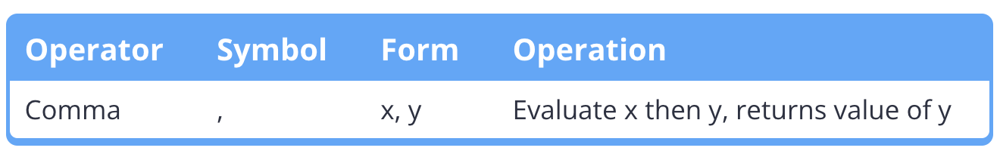

# Chapter 5 - Operators

## [5.1 - Operator precedence and associativity](https://www.learncpp.com/cpp-tutorial/operator-precedence-and-associativity/)

### 5.1.1 - Operator precedence

**What is Operator Precedence**
The order in which operators are evaluated in a compound expression is determined by an operator’s precedence.

**Operator's Level of Precedence**
In C++, when the compiler encounters an expression, it must similarly analyze the expression and determine how it should
be evaluated. To assist with this, all operators are assigned a level of precedence. Operators with the highest level of
precedence are evaluated first.

**Higher Priority = Smaller Precedence Level Value**
Higher priority means smaller value of precedence. For example, multiplication and division are of precedence level 5
while addition and subtraction are of precedence level 6.

### 5.1.2 - Operator associativity

**Operator associativity**
If two operators with the same precedence level are adjacent to each other in an expression, the operator’s
**associativity** tells the compiler whether to evaluate the operators from left to right or from right to left.

**The Associativity in Expression `3 * 4 / 2`**
The operators in precedence level 5 have an associativity of left to right, so the expression is resolved from left to
right: (3 * 4) / 2 = 6.

**C++ Operator Precedence(in. Associativity for Each Level)**
Check this page from [cppreference.com](https://en.cppreference.com/w/).  
https://en.cppreference.com/w/cpp/language/operator_precedence

The [learncpp.com](learncpp.com) also has a table for that.
https://www.learncpp.com/cpp-tutorial/operator-precedence-and-associativity/

### 5.1.3 - Parenthesization

**Parenthesization Works cuz its Precedence Level(Level 2)**
You can explicitly parenthesize the expression to make it evaluate the way you want. This works in C++ because
parentheses have one of the highest precedence levels, so parentheses generally evaluate before whatever is inside them.

**Best Practice**
Use parentheses to make it clear how a non-trivial expression should evaluate (even if they are technically
unnecessary).

## [5.2 — Arithmetic operators](https://www.learncpp.com/cpp-tutorial/arithmetic-operators/)

### 5.2.1 - Unary arithmetic operators

There are two unary arithmetic operators,

1. plus (+)
   The unary plus operator returns the value of the operand. In other words, +5 is 5, and +x is x. Generally you won’t
   need to use this operator since it’s redundant. It was added largely to provide symmetry with the unary minus
   operator.
2. minus (-).
   The unary minus operator returns the operand multiplied by -1. In other words, if x = 5, -x is -5.

As a reminder, unary operators are operators that only take one operand.

### 5.2.2 - Binary arithmetic operators

There are 5 binary arithmetic operators. Binary operators are operators that take a left and right operand.


The addition, subtraction, and multiplication operators work just like they do in real life, with no caveats.

Division and modulus (remainder) need some additional explanation.

#### Integer and floating point division

Think of division as having two modes.

**Mode 1: Integer Division**
If both of the operands are integers, the division operator performs integer division. Integer division drops any
fractions and returns an integer value.

**Mode 2: Floating Point Division**
Floating point division returns a floating point value, and the fraction is kept. As with all floating point arithmetic
operations, rounding errors may occur.

#### Dividing by 0 and 0.0 - Undefined Behavior

### 5.2.3 - Arithmetic assignment operators


## [5.3 — Modulus and Exponentiation](https://www.learncpp.com/cpp-tutorial/5-3-modulus-and-exponentiation/)

### 5.3.1 - Modulus Operator

**Modulus**

**Modulus with Negative Numbers**
`x % y` always returns results with the sign of x.

### 5.3.2 - Exponent Operator

To do exponents in C++, `#include` the `<cmath>` header, and use the `pow()` function:

```c++
#include <cmath>

double x{ std::pow(3.0, 4.0) }; // 3 to the 4th power
```

Note that the parameters (and return value) of function pow() are of type double. Due to rounding errors in floating
point numbers, the results of pow() may not be precise (even if you pass it integers or whole numbers).

## [5.4 — Increment/decrement operators, and side effects](https://www.learncpp.com/cpp-tutorial/increment-decrement-operators-and-side-effects/)

**Best practice**
Strongly favor the prefix version of the increment and decrement operators, as they are generally more performant, and
you’re less likely to run into strange issues with them.

**Warning**
C++ does not define the order of evaluation for function arguments or the operands of operators.
Don’t use a variable that has a side effect applied to it more than once in a given statement. If you do, the result may
be undefined. These examples include `x + ++x` and `add(x, ++x)`.

## [5.5 — Comma and conditional operators](https://www.learncpp.com/cpp-tutorial/comma-and-conditional-operators/)

### 5.5.1 - The comma operator



Example: evaluate left operand first, then evaluate right operand, finally return the right operand evaluation result
https://leetcode.com/playground/GBYR5PyC

Comma has the lowest precedence of all the operators, even lower than assignment. Because of this, the following two
lines of code do different things:

```c++
z = (a, b); // evaluate (a, b) first to get result of b, then assign that value to variable z.
z = a, b; // evaluates as "(z = a), b", so z gets assigned the value of a, and b is evaluated and discarded.
```

It is quite dangerous to use comma. Avoid using it in most case.

**Best practice**
Avoid using the comma operator, except within for loops.

### 5.5.2 - The conditional operator


The conditional operator (?:) (also sometimes called the “arithmetic if” operator) is a ternary operator (it takes 3
operands). Because it has historically been C++’s only ternary operator, it’s also sometimes referred to as “the ternary
operator”.

The ?: operator takes the following form:

```text
(condition) ? expression1 : expression2;
```

If condition evaluates to true, then expression1 is executed, otherwise expression2 is executed. Note that expression2
is not optional.

**Best practice**
Always parenthesize the conditional part of the conditional operator, and consider parenthesizing the whole thing as
well.

**The type of the expressions must match or be convertible**
To properly comply with C++’s type checking, either the type of both expressions in a conditional statement must match,
or the both expressions must be convertible to a common type.

## [5.6 — Relational operators and floating point comparisons](https://www.learncpp.com/cpp-tutorial/relational-operators-and-floating-point-comparisons/)

Relational operators are operators that let you compare two values. There are 6 relational operators


Each of these operators evaluates to the boolean value true (1), or false (0).

### 5.6.1 - Avoid using relational operators on floating point comparisons

1. Due to the rounding error, using relational operators on floating point comparisons is problematic.
2. One exception, it is okay to compare a low-precision (few significant digits) floating point literal to the same
   literal value of the same type. Since they are literal and has unique presentation in memory.

### 5.6.2 - Comparing floating point numbers

#### Epsilon

The most common method of doing floating point equality involves using a function that looks to see if two numbers are
almost the same. If they are “close enough”, then we call them equal. The value used to represent “close enough” is
traditionally called epsilon. Epsilon is generally defined as a small positive number (e.g. 0.00000001, sometimes
written 1e-8).

New developers often try to write their own “close enough” function like this:

```c++
#include <cmath> // for std::abs()

// epsilon is an absolute value
bool approximatelyEqualAbs(double a, double b, double absEpsilon)
{
  // if the distance between a and b is less than absEpsilon, then a and b are "close enough"
  return std::abs(a - b) <= absEpsilon;
}
```

#### Relative Epsilon from Donald Knuth

```c++
#include <algorithm> // std::max
#include <cmath> // std::abs

// return true if the difference between a and b is within epsilon percent of the larger of a and b
bool approximatelyEqualRel(double a, double b, double relEpsilon)
{
    return (std::abs(a - b) <= (std::max(std::abs(a), std::abs(b)) * relEpsilon));
}
```

1. On the left side of the <= operator, std::abs(a - b) tells us the distance between a and b as a positive number.
2. On the right side of the <= operator, we need to calculate the largest value of “close enough” we’re willing to
   accept. To do this, the algorithm chooses the larger of a and b (as a rough indicator of the overall magnitude of the
   numbers), and then multiplies it by relEpsilon. In this function, relEpsilon represents a percentage. For example, if
   we want to say “close enough” means a and b are within 1% of the larger of a and b, we pass in an relEpsilon of
   0.01 (1% = 1/100 = 0.01).

#### Absolute Epsilon for Zero-Close Value + Relative Epsilon

```c++
// return true if the difference between a and b is less than absEpsilon, or within relEpsilon percent of the larger of a and b
bool approximatelyEqualAbsRel(double a, double b, double absEpsilon, double relEpsilon) {
// Check if the numbers are really close -- needed when comparing numbers near zero.
double diff{
std::abs(a - b)
};
if (diff <= absEpsilon) return true;

// Otherwise fall back to Knuth's algorithm
return (diff <= (std::max(std::abs(a), std::abs(b)) * relEpsilon));
}
```

In this algorithm,

1. we first check if a and b are close together in absolute terms, which handles the case where a and b are both close
   to zero. The absEpsilon parameter should be set to something very small (e.g. 1e-12).
2. If that fails, then we fall back to Knuth’s algorithm, using the relative epsilon.

## [5.7 — Logical operators](https://www.learncpp.com/cpp-tutorial/logical-operators/)

Logical operators provide us with the capability to test multiple conditions.

C++ has 3 logical operators:


### 5.7.1 - Logical NOT

Logical NOT flips a Boolean value from true to false, and vice-versa.

**Best practice**
Since logical NOT has very high level of precedence, if logical NOT is intended to operate on the result of other
operators, the other operators and their operands need to be enclosed in parentheses.

For example, `!x < y` will be evaluated as `(!x) < y`, so the best way is `!(x < y)` if this is as intended.

### 5.7.2 - Logical OR and Logical AND

**Distinguish**

1. the logical OR operator (||) with the bitwise bitwise OR operator (|).
2. the logical AND operator (&&) with the bitwise AND operator (&).

### 5.7.3 - Short circuit evaluation

**Short Circuit Evaluation in Logical AND**
In order for logical AND to return true, both operands must evaluate to true. If the first operand evaluates to false,
logical AND knows it must return false regardless of whether the second operand evaluates to true or false. In this
case, the logical AND operator will go ahead and return false immediately without even evaluating the second operand!

**Short Circuit Evaluation in Logical OR**
Similarly, if the first operand for logical OR is true, then the entire OR condition has to evaluate to true, and the
second operand won’t be evaluated.

**Avoid Side Effects in Short Circuit Evaluation**
Short circuit evaluation may cause Logical OR and Logical AND to not evaluate one operand. Avoid using expressions with
side effects in conjunction with these operators.

For example, in the statement `if (x == 1 && ++y == 2)`, if `x != 1`, then `++y` never gets evaluated and `y` will never
be incremented.

### 5.7.4 - Mixing ANDs and ORs

Logical AND has higher precedence than logical OR, thus logical AND operators will be evaluated ahead of logical OR
operators (unless they have been parenthesized)

**Best practice**
When mixing logical AND and logical OR in a single expression, explicitly parenthesize each operation to ensure they
evaluate how you intend.

### 5.7.5 - XOR Operator

Logical XOR is a logical operator provided in some languages that is used to test whether an odd number of conditions is
true.


However, you can easily mimic logical XOR using the inequality operator (!=):

```c++
if (a != b) ... // a XOR b, assuming a and b are Booleans
```

### 5.7.6 - Alternative operator representations

Historically, not all keyboards and language standards have supported all of the symbols needed to type these operators.
As such, C++ supports an alternative set of keywords for the operators that use words instead of symbols.


