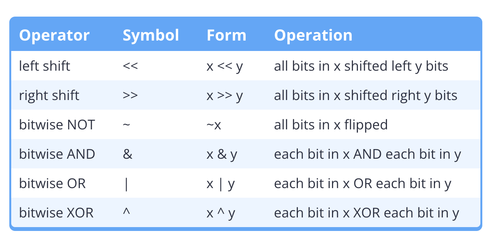
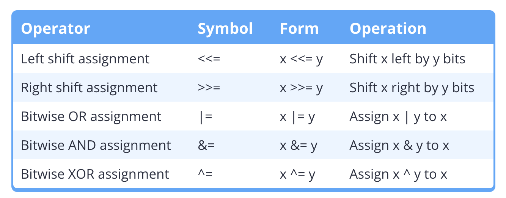
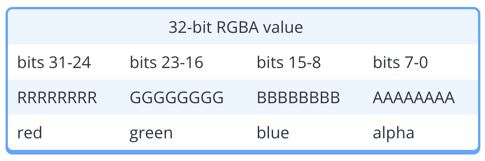

# O - Bit Manipulation (optional chapter)

## [O.1 — Bit flags and bit manipulation via std::bitset](https://www.learncpp.com/cpp-tutorial/bit-flags-and-bit-manipulation-via-stdbitset/)

### O.1.1 - Basics about Bit and Why we need Bit Maniputation

1. On modern computer architectures, the smallest addressable unit of memory is a byte. Since all objects need to have
   unique memory addresses, this means objects must be at least one byte in size.
2. For boolean values, 1 bit is enough, so 1 Byte is a little bit wasteful, since it has 8 bits and could be used as 8
   boolean values.
3. C++ allows us to pack multiple boolean values in Byte. Modifying individual bits within an object is called **bit
   manipulation**.

### O.1.2 - Bit flags

When individual bits of an object are used as Boolean values, the bits are called **bit flags**.

When individual bits of an object are used as Boolean values, the bits are called bit flags.

```c++
#include <bitset> // for std::bitset

std::bitset<8> mybitset {}; // 8 bits in size means room for 8 flags
```

### O.1.3 - Bit numbering and bit positions

Given a sequence of bits:

1. number the bits from right to left
2. starting with 0 (not 1). Each number denotes a bit position.

```c++
76543210  Bit position
00000101  Bit sequence
```

### O.1.4 - Manipulating bits via `std::bitset`

`std::bitset` provides 4 key functions that are useful for doing bit manipulation:

1. `test()` allows us to query whether a bit is a 0 or 1
2. `set()` allows us to turn a bit on (this will do nothing if the bit is already on)
3. `reset()` allows us to turn a bit off (this will do nothing if the bit is already off)
4. `flip()` allows us to flip a bit value from a 0 to a 1 or vice versa

Here is an example hosted on LeetCode playground https://leetcode.com/playground/NCH4nB2i.
Remember `0b` is a prefix for binary presentation of a number.

### O.1.5 - The size of `std::bitset`

One potential surprise is that std::bitset is optimized for speed, not memory savings. The size of a std::bitset is
typically the number of bytes needed to hold the bits, rounded up to the nearest sizeof(size_t), which is 4 bytes on
32-bit machines, and 8-bytes on 64-bit machines.

Thus, a std::bitset<8> will typically use either 4 or 8 bytes of memory, even though it technically only needs 1 byte to
store 8 bits. **Thus, std::bitset is most useful when we desire convenience, not memory savings.**

This is an example hosted on LeetCode playground showing the size of a bitset:
https://leetcode.com/playground/TfcmAhm5

## [O.2 — Bitwise operators](https://www.learncpp.com/cpp-tutorial/bitwise-operators/)

C++ provides 6 bit manipulation operators, often called bitwise operators:


To avoid surprises, use the bitwise operators with unsigned operands or std::bitset. Do not use them on signed operands.

### O.2.1 - Bitwise left shift (<<) and bitwise right shift (>>) operators

#### Bitwise Left Shift

The bitwise left shift (<<) operator shifts bits to the left. The left operand is the expression to shift the bits of,
and the right operand is an integer number of bits to shift left by.

0011 << 1 is 0110
0011 << 2 is 1100
0011 << 3 is 1000

#### Bitwise Right Shift

The bitwise right shift (>>) operator shifts bits to the right.

1100 >> 1 is 0110
1100 >> 2 is 0011
1100 >> 3 is 0001, one 1 is lost

Here is an example hosted on LeetCode playground for exploring bitwise operators:
https://leetcode.com/playground/eVECNsvw

### O.2.2 - Bitwise NOT

The bitwise NOT operator (~) is perhaps the easiest to understand of all the bitwise operators. It simply flips each bit
from a 0 to a 1, or vice versa.

Note that the result of a bitwise NOT is dependent on what size your data type is.

### O.2.3 - Bitwise OR

Bitwise OR evaluates to 1 if either the left, right, or both bits are 1, and 0 otherwise.

```text
0 1 0 1 OR
0 1 1 0
-------
0 1 1 1
```

### O.2.4 - Bitwise AND

Logical AND evaluates to true if both the left and right operand evaluate to true.

```text
0 1 0 1 AND
0 1 1 0
--------
0 1 0 0
```

### O.2.5 - Bitwise XOR

When evaluating two operands, XOR evaluates to true (1) if one and only one of its operands is true (1). If neither or
both are true, it evaluates to 0.

```text
0 1 1 0 XOR
0 0 1 1
-------
0 1 0 1
```

It is also possible to evaluate compound XOR expression column style, such as 0b0001 ^ 0b0011 ^ 0b0111. If there are an
even number of 1 bits in a column, the result is 0. If there are an odd number of 1 bits in a column, the result is 1.

```text
0 0 0 1 XOR
0 0 1 1 XOR
0 1 1 1
--------
0 1 0 1
```

### O.2.6 - Bitwise assignment operators



No bitwise-no assignment operator, just use the original assignment, since bitwise no is unary.

## [O.3 — Bit manipulation with bitwise operators and bit masks](https://www.learncpp.com/cpp-tutorial/bit-manipulation-with-bitwise-operators-and-bit-masks/)

### O.3.1 - Bit masks

A **bit mask** is a predefined set of bits that is used to select which specific bits will be modified by subsequent
operations.

**Analogies for Understanding Bitmask**
Using a bitmask is similar to using masking tape, as it uses specific bits to protect or mask data or functions at the
binary level.

The bit mask blocks the bitwise operators from touching bits we don’t want modified, and allows access to
the ones we do want modified.

### O.3.2 - Defining bit masks in C++14

The simplest set of bit masks is to define one bit mask for each bit position. We use 0s to mask out the bits we don’t
care about, and 1s to denote the bits we want modified.

Although bit masks can be literals, they’re often defined as symbolic constants so they can be given a meaningful name
and easily reused.

Because C++14 supports binary literals, defining these bit masks is easy:

```c++
#include <cstdint>

constexpr std::uint8_t mask0{ 0b0000'0001 }; // represents bit 0
constexpr std::uint8_t mask1{ 0b0000'0010 }; // represents bit 1
constexpr std::uint8_t mask2{ 0b0000'0100 }; // represents bit 2
constexpr std::uint8_t mask3{ 0b0000'1000 }; // represents bit 3
constexpr std::uint8_t mask4{ 0b0001'0000 }; // represents bit 4
constexpr std::uint8_t mask5{ 0b0010'0000 }; // represents bit 5
constexpr std::uint8_t mask6{ 0b0100'0000 }; // represents bit 6
constexpr std::uint8_t mask7{ 0b1000'0000 }; // represents bit 7
```

Now we have a set of symbolic constants that represents each bit position. We can use these to manipulate the bits (
which we’ll show how to do in just a moment).

### O.3.3 - Defining bit masks in C++11 or earlier

Because C++11 doesn’t support binary literals, we have to use other methods to set the symbolic constants. There are two
good methods for doing this.

#### use hexadecimal literals

We can define bit masks using hexadecimal like this:

```c++
constexpr std::uint8_t mask0{ 0x01 }; // hex for 0000 0001
constexpr std::uint8_t mask1{ 0x02 }; // hex for 0000 0010
constexpr std::uint8_t mask2{ 0x04 }; // hex for 0000 0100
constexpr std::uint8_t mask3{ 0x08 }; // hex for 0000 1000
constexpr std::uint8_t mask4{ 0x10 }; // hex for 0001 0000
constexpr std::uint8_t mask5{ 0x20 }; // hex for 0010 0000
constexpr std::uint8_t mask6{ 0x40 }; // hex for 0100 0000
constexpr std::uint8_t mask7{ 0x80 }; // hex for 1000 0000
```

#### Use left-shift operators

An easier method is to use the left-shift operator to shift a single bit into the proper location:

```c++
constexpr std::uint8_t mask0{ 1 << 0 }; // 0000 0001
constexpr std::uint8_t mask1{ 1 << 1 }; // 0000 0010
constexpr std::uint8_t mask2{ 1 << 2 }; // 0000 0100
constexpr std::uint8_t mask3{ 1 << 3 }; // 0000 1000
constexpr std::uint8_t mask4{ 1 << 4 }; // 0001 0000
constexpr std::uint8_t mask5{ 1 << 5 }; // 0010 0000
constexpr std::uint8_t mask6{ 1 << 6 }; // 0100 0000
constexpr std::uint8_t mask7{ 1 << 7 }; // 1000 0000
```

### O.3.4 - Using bitmask

1. Testing a bit - bitwise AND operator
2. Setting a bit(Turn on a bit) - bitwise OR Assignment operator
3. Resetting a bit(Turn off a bit) - bitwise AND operator + bitwise NO operator
4.

#### O.3.4.1 - Testing a bit (to see if it is on or off)

To determine if a bit is on or off, we use bitwise AND in conjunction with the bit mask for the appropriate bit:

[Replit Online Example](https://replit.com/@442584863/testing-a-bit-AND#main.cpp)

```c++
#include <cstdint>
#include <iostream>

int main()
{
	[[maybe_unused]] constexpr std::uint8_t mask0{ 0b0000'0001 }; // represents bit 0
	[[maybe_unused]] constexpr std::uint8_t mask1{ 0b0000'0010 }; // represents bit 1
	[[maybe_unused]] constexpr std::uint8_t mask2{ 0b0000'0100 }; // represents bit 2
	[[maybe_unused]] constexpr std::uint8_t mask3{ 0b0000'1000 }; // represents bit 3
	[[maybe_unused]] constexpr std::uint8_t mask4{ 0b0001'0000 }; // represents bit 4
	[[maybe_unused]] constexpr std::uint8_t mask5{ 0b0010'0000 }; // represents bit 5
	[[maybe_unused]] constexpr std::uint8_t mask6{ 0b0100'0000 }; // represents bit 6
	[[maybe_unused]] constexpr std::uint8_t mask7{ 0b1000'0000 }; // represents bit 7

	std::uint8_t flags{ 0b0000'0101 }; // 8 bits in size means room for 8 flags

	std::cout << "bit 0 is " << ((flags & mask0) ? "on\n" : "off\n");
	std::cout << "bit 1 is " << ((flags & mask1) ? "on\n" : "off\n");

	return 0;
}
```

#### O.3.4.2 - Setting a bit

To set (turn on) a bit, we use bitwise OR equals (operator |=) in conjunction with the bit mask for the appropriate bit:

```c++
#include <cstdint>
#include <iostream>

int main()
{
    [[maybe_unused]] constexpr std::uint8_t mask0{ 0b0000'0001 }; // represents bit 0
    [[maybe_unused]] constexpr std::uint8_t mask1{ 0b0000'0010 }; // represents bit 1
    [[maybe_unused]] constexpr std::uint8_t mask2{ 0b0000'0100 }; // represents bit 2
    [[maybe_unused]] constexpr std::uint8_t mask3{ 0b0000'1000 }; // represents bit 3
    [[maybe_unused]] constexpr std::uint8_t mask4{ 0b0001'0000 }; // represents bit 4
    [[maybe_unused]] constexpr std::uint8_t mask5{ 0b0010'0000 }; // represents bit 5
    [[maybe_unused]] constexpr std::uint8_t mask6{ 0b0100'0000 }; // represents bit 6
    [[maybe_unused]] constexpr std::uint8_t mask7{ 0b1000'0000 }; // represents bit 7

    std::uint8_t flags{ 0b0000'0101 }; // 8 bits in size means room for 8 flags

    std::cout << "bit 1 is " << ((flags & mask1) ? "on\n" : "off\n");

    flags |= mask1; // turn on bit 1

    std::cout << "bit 1 is " << ((flags & mask1) ? "on\n" : "off\n");

    return 0;
}
```

#### O.3.4.3 - Resetting a bit

To clear a bit (turn off), we use Bitwise AND and Bitwise NOT together:

```c++
#include <cstdint>
#include <iostream>

int main()
{
    [[maybe_unused]] constexpr std::uint8_t mask0{ 0b0000'0001 }; // represents bit 0
    [[maybe_unused]] constexpr std::uint8_t mask1{ 0b0000'0010 }; // represents bit 1
    [[maybe_unused]] constexpr std::uint8_t mask2{ 0b0000'0100 }; // represents bit 2
    [[maybe_unused]] constexpr std::uint8_t mask3{ 0b0000'1000 }; // represents bit 3
    [[maybe_unused]] constexpr std::uint8_t mask4{ 0b0001'0000 }; // represents bit 4
    [[maybe_unused]] constexpr std::uint8_t mask5{ 0b0010'0000 }; // represents bit 5
    [[maybe_unused]] constexpr std::uint8_t mask6{ 0b0100'0000 }; // represents bit 6
    [[maybe_unused]] constexpr std::uint8_t mask7{ 0b1000'0000 }; // represents bit 7

    std::uint8_t flags{ 0b0000'0101 }; // 8 bits in size means room for 8 flags

    std::cout << "bit 2 is " << ((flags & mask2) ? "on\n" : "off\n");

    flags &= ~mask2; // turn off bit 2

    std::cout << "bit 2 is " << ((flags & mask2) ? "on\n" : "off\n");

    return 0;
}
```

Some compiler may cause integral promotion and report warning message. Do static cast to resolve the issue.

```c++
flags &= static_cast<std::uint8_t>(~mask2);
```

#### O.3.4.4 - Flipping a bit

To toggle a bit state, we use Bitwise XOR:

```c++
#include <cstdint>
#include <iostream>

int main()
{
    [[maybe_unused]] constexpr std::uint8_t mask0{ 0b0000'0001 }; // represents bit 0
    [[maybe_unused]] constexpr std::uint8_t mask1{ 0b0000'0010 }; // represents bit 1
    [[maybe_unused]] constexpr std::uint8_t mask2{ 0b0000'0100 }; // represents bit 2
    [[maybe_unused]] constexpr std::uint8_t mask3{ 0b0000'1000 }; // represents bit 3
    [[maybe_unused]] constexpr std::uint8_t mask4{ 0b0001'0000 }; // represents bit 4
    [[maybe_unused]] constexpr std::uint8_t mask5{ 0b0010'0000 }; // represents bit 5
    [[maybe_unused]] constexpr std::uint8_t mask6{ 0b0100'0000 }; // represents bit 6
    [[maybe_unused]] constexpr std::uint8_t mask7{ 0b1000'0000 }; // represents bit 7

    std::uint8_t flags{ 0b0000'0101 }; // 8 bits in size means room for 8 flags

    std::cout << "bit 2 is " << ((flags & mask2) ? "on\n" : "off\n");
    flags ^= mask2; // flip bit 2
    std::cout << "bit 2 is " << ((flags & mask2) ? "on\n" : "off\n");
    flags ^= mask2; // flip bit 2
    std::cout << "bit 2 is " << ((flags & mask2) ? "on\n" : "off\n");

    return 0;
}
```

We can flip multiple bits simultaneously:

```c++
flags ^= (mask4 | mask5); // flip bits 4 and 5 at the same time
```

### O.3.5 - Bit masks and `std::bitset`

Why not `std::bitset` but bit masks? The functions only allow you to modify individual bits. The bitwise operators allow
you to modify multiple bits at once.

### O.3.6 - Making bit masks meaningful

Naming our bit masks “mask1” or “mask2” tells us what bit is being manipulated, but doesn’t give us any indication of
what that bit flag is actually being used for.

A best practice is to give your bit masks useful names as a way to document the meaning of your bit flags. Here’s an
example from a game we might write:

```c++
#include <cstdint>
#include <iostream>

int main()
{
        // Define a bunch of physical/emotional states
	[[maybe_unused]] constexpr std::uint8_t isHungry{	1 << 0 }; // 0000 0001
	[[maybe_unused]] constexpr std::uint8_t isSad{		1 << 1 }; // 0000 0010
	[[maybe_unused]] constexpr std::uint8_t isMad{		1 << 2 }; // 0000 0100
	[[maybe_unused]] constexpr std::uint8_t isHappy{	1 << 3 }; // 0000 1000
	[[maybe_unused]] constexpr std::uint8_t isLaughing{ 	1 << 4 }; // 0001 0000
	[[maybe_unused]] constexpr std::uint8_t isAsleep{	1 << 5 }; // 0010 0000
	[[maybe_unused]] constexpr std::uint8_t isDead{		1 << 6 }; // 0100 0000
	[[maybe_unused]] constexpr std::uint8_t isCrying{	1 << 7 }; // 1000 0000

	std::uint8_t me{}; // all flags/options turned off to start
	me |= (isHappy | isLaughing); // I am happy and laughing
	me &= ~isLaughing; // I am no longer laughing

	// Query a few states
	// (we'll use static_cast<bool> to interpret the results as a boolean value)
	std::cout << "I am happy? " << static_cast<bool>(me & isHappy) << '\n';
	std::cout << "I am laughing? " << static_cast<bool>(me & isLaughing) << '\n';

	return 0;
}
```

### O.3.6 - When are bit flags most useful?

#### many identical flag variables

Bit flags make the most sense when you have many identical flag variables. For example, in the example above, imagine
that instead of having one person (me), you had 100. If you used 8 Booleans per person (one for each possible state),
you’d use 800 bytes of memory. With bit flags, you’d use 8 bytes for the bit masks, and 100 bytes for the bit flag
variables, for a total of 108 bytes of memory -- approximately 8 times less memory.

#### Too many boolean parameters for function

Bit flags and bit masks can be used to pass multiple options to a function, instead of using multiple Boolean
parameters.

For example, to call a function with 32 Boolean parameters, 32 boolean values are required, making it almost
non-readable:

```c++
someFunction(false, false, false, false, false, false, false, false, false, true, false, false, false, false, false, 
             false, false, false, false, false, false, false, false, false, false, false, false, false, false, false, 
             false, true);
```

It can be replaced by using a single bit flags parameter. This makes the function call more readable and likely more
performant.

```c++
// use bitset instead of 32 boolean values in the function definition
void someFunction(std::bitset<32> options);

// call function with bit flags
someFunction(option10 | option32);
```

Below is an example of how OpenGL uses bit masks as parameters for its functions.

```c++
glClear(GL_COLOR_BUFFER_BIT | GL_DEPTH_BUFFER_BIT); // clear the color and the depth buffer

// GL_COLOR_BUFFER_BIT and GL_DEPTH_BUFFER_BIT are bit masks defined as follows (in gl2.h):
#define GL_DEPTH_BUFFER_BIT               0x00000100
#define GL_STENCIL_BUFFER_BIT             0x00000400
#define GL_COLOR_BUFFER_BIT               0x00004000
```

### O.3.7 - Bit masks involving multiple bits

Although bit masks often are used to select a single bit, they can also be used to select multiple bits. Here is an
example.

**Background Knowledge**

Color could be represented using 4 8-bit numbers. They are R for red, G for green, B for blue, and A for alpha(
transparency). R, G, B, and A are normally stored in a 32-bit integer.



The following program asks the user to enter a 32-bit hexadecimal value, and then extracts the 8-bit color values for R,
G, B, and A.

```c++
#include <cstdint>
#include <iostream>

int main()
{
	constexpr std::uint32_t redBits{ 0xFF000000 };
	constexpr std::uint32_t greenBits{ 0x00FF0000 };
	constexpr std::uint32_t blueBits{ 0x0000FF00 };
	constexpr std::uint32_t alphaBits{ 0x000000FF };

	std::cout << "Enter a 32-bit RGBA color value in hexadecimal (e.g. FF7F3300): ";
	std::uint32_t pixel{};
	std::cin >> std::hex >> pixel; // std::hex allows us to read in a hex value

	// use Bitwise AND to isolate red pixels,
	// then right shift the value into the lower 8 bits
	std::uint8_t red{ static_cast<std::uint8_t>((pixel & redBits) >> 24) };
	std::uint8_t green{ static_cast<std::uint8_t>((pixel & greenBits) >> 16) };
	std::uint8_t blue{ static_cast<std::uint8_t>((pixel & blueBits) >> 8) };
	std::uint8_t alpha{ static_cast<std::uint8_t>(pixel & alphaBits) };

	std::cout << "Your color contains:\n";
	std::cout << std::hex; // print the following values in hex
	std::cout << static_cast<int>(red)   << " red\n";
	std::cout << static_cast<int>(green) << " green\n";
	std::cout << static_cast<int>(blue)  << " blue\n";
	std::cout << static_cast<int>(alpha) << " alpha\n";

	return 0;
}
```

### O.3.8 - Summary

Summarizing how to set, clear, toggle, and query bit flags:

To query bit states, we use bitwise AND:

```c++
if (flags & option4) ... // if option4 is set, do something
```

To set bits (turn on), we use bitwise OR:

```c++
flags |= option4; // turn option 4 on.
flags |= (option4 | option5); // turn options 4 and 5 on.
```

To clear bits (turn off), we use bitwise AND with bitwise NOT:

```c++
flags &= ~option4; // turn option 4 off
flags &= ~(option4 | option5); // turn options 4 and 5 off
```

To flip bit states, we use bitwise XOR:

```c++
flags ^= option4; // flip option4 from on to off, or vice versa
flags ^= (option4 | option5); // flip options 4 and 5
```

## [O.4 — Converting between binary and decimal](https://www.learncpp.com/cpp-tutorial/converting-between-binary-and-decimal/)

### O.4.1 - Converting binary to decimal

Skip.

### O.4.2 - Method 1 for converting decimal to binary(bottom up)

Converting from decimal to binary is a little more tricky, but still pretty straightforward. There are two good methods
to do this.

The first method involves continually dividing by 2, and writing down the remainders. The binary number is constructed
at the end from the remainders, from the bottom up.

Converting 148 from decimal to binary (using r to denote a remainder):

148 / 2 = 74 r0
74 / 2 = 37 r0
37 / 2 = 18 r1
18 / 2 = 9 r0
9 / 2 = 4 r1
4 / 2 = 2 r0
2 / 2 = 1 r0
1 / 2 = 0 r1

Writing all of the remainders from the bottom up: 1001 0100

148 decimal = 1001 0100 binary.

### O.4.3 - Method 2 for converting decimal to binary(top down)

The method involves finding the largest power of 2 that is smaller than the decimal number and then subtracting that
power of 2 from the number to find the value of the next bit.

### O.4.4 - Adding in binary

Skip.

### O.4.5 - Signed numbers and two’s complement

Signed integers are typically stored using a method known as two’s complement. In two’s complement, the leftmost (most
significant) bit is used as the sign bit.

A 0 sign bit means the number is positive, and a 1 sign bit means the number is negative.

Positive signed numbers are represented in binary just like positive unsigned numbers (with the sign bit set to 0).

Negative signed numbers are represented in binary as the bitwise inverse of the positive number, plus 1.

#### Converting decimal to binary (two’s complement)

Flip all bits and add one.

#### Converting binary (two’s complement) to decimal

To convert a two’s complement binary number back into decimal, first look at the sign bit.

If the sign bit is 0, just convert the number as shown for unsigned numbers above.

If the sign bit is 1, then we invert the bits, add 1, then convert to decimal, then make that decimal number negative (
because the sign bit was originally negative).

### O.4.6 - Why types matter

The type of a variable in C++ determines how the variable's value is encoded into binary and decoded back into a value.
For instance, if the variable type is an unsigned integer, binary 1011 0100 would be printed as 180, but if the variable
type is a signed integer, it would be printed as -76, because it would be interpreted as two's complement.
